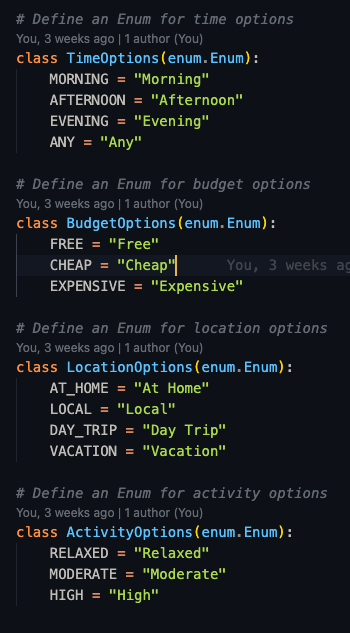

# **The Date Vault**

This website is designed to help couples plan date nights by allowing them to store and randomly retrieve date ideas. Couples can input their unique date ideas with specific compulsory fields. Later, they can filter and request a random idea that suits their preferences from the database they have built over time.

You can access the live site via the following URL. - https://github.com/LukeThornton92/Milestone-Project-3-DATEVAULT

## **Site Overview**

## Table of Contents:

1. [**Site Overview**](#site-overview)
2. [**Planning stage**](#planning-stage)
   - [**_Target Audiences_**](#target-audiences)
   - [**_User Stories_**](#user-stories)
   - [**_Site Aims_**](#site-aims)
   - [**_How Will This Be Achieved_**](#how-will-this-be-achieved)
   - [**_Research_**](#research)
   - [**_Wireframes_**](#wireframes)
3. [**Building Stage**](#building-stage)
   - [**_Colour Scheme_**](#colour-scheme)
   - [**_Typography_**](#typography)
4. [**Features**](#features)
   - [**_Home Page_**](#home-page)
   - [**_404_**](#404)
5. [**Future Enhancements**](#future-enhancements)
6. [**Testing**](#testing)
   - [**_Validator Testing_**](#validator-testing)
7. [**Deployment**](#deployment)
8. [**Credits**](#credits)
   - [**_Honourable Mentions_**](#honourable-mentions)
   - [**_General Reference_**](#general-refrence)
   - [**_Content_**](#content)
   - [**_Media_**](#media)

---

## **Planning Stage**

### **Target Audiences:**

- Couples of all ages looking for fresh and fun date ideas to strengthen their relationship.
- Busy partners who want a quick and easy way to generate personalized date plans without spending hours planning.
- Long-term couples seeking new and spontaneous experiences to break routine and keep things exciting.
- Tech-savvy or beginner users who appreciate a user-friendly platform for managing and discovering date ideas.

### **User Stories:**

- As a user, I want to easily input date ideas with specific details so that I can save them for future use.
- As a user, I want to filter date ideas by budget, location, and activity type so I can find the perfect idea for my needs.
- As a user, I want to receive a randomized date idea from my filtered results so I can experience something new and exciting.
- As a user, I want to edit or update my saved date ideas so I can keep my list relevant and up-to-date.
- As a user, I want the interface to be simple and intuitive so I can quickly navigate the site without confusion.
- As a user, I want my data to be stored securely so that I can trust my personal information is safe.

### **Site Aims:**

- To create an accessible and intuitive platform for couples to share and retrieve personalized date ideas.
- To ensure the system offers a variety of filters to allow for a personalized experience when retrieving date ideas.
- To provide randomised suggestions based on user preferences to keep the experience fun and spontaneous.
- To encourage couples to build a rich database of date ideas over time.
- To have a professional look and feel suitable for adults.

### **How Will This Be Achieved:**

My project will ensure the above aims and features are accomplished by successfully achieving the following targets.

- **Database Integration:** Set up a database to store date ideas with compulsory fields (e.g., activity type, cost, duration).
- **Date Input Form:** Develop a form to capture date ideas with validation for compulsory fields.
- **Search and Filter Functionality:** Implement a filtering system based on user preferences such as budget, activity type, and location.
- **Random Date Selector:** Create functionality that selects a random date idea from the filtered search results.
- **User Interface Design:** Focus on building an intuitive, attractive interface for easy navigation and interaction.
- **Security:** Implement basic security features to protect user input and data.

### **Nice To Have's:**

The following items will be nice to have, I will aim to get them into the website in time but these will not be the initial focus.

- Ability to email partners to sign up.
- Google calendar invite for desired dates.

### **Research:**

1. https://mattbateman.net/fun/date-idea-generator/

#### Likes

> - First site found when searched.
> - Has filters.

#### Dislikes

> - Very basic.
> - Cant personalize.
> - Poor design.
> - Can't save any ideas.

---

2. https://thedateidea.com/

#### Likes

> - Modern design.
> - Has blog posts around certain types of dates/date ideas.
> - Lists all date ideas.

#### Dislikes

> - No filters, just a button for randomizing.
> - Can't save any ideas.
> - Poor ad placements.

---

3.  https://myspicyvanilla.com/

Claims to use "AI".

#### Likes

> - Has a function to sign up, will save your ideas.
> - Dates can be shared on Whatsapp and social media.

#### Dislikes

> - Design feels off, colour scheme seems like a poor choice, very dark.
> - Allows only 1 random date before being behind pay wall.

---

4.  https://lovewick.com/ (App)

#### Likes

> - Very professional design, what I aspire to be.
> - Have built on all aspects of dating.

#### Dislikes

> - Less emphasis on your own ideas being in rotation, more for people without ideas.
> - Non web based, all on the app.

---

### **Inspiration:**

Knowing that I want this website to be aimed at adults I needed to do some research into desired styles, I used the website Awwwards for inspiration and came across [Inside The Head](https://www.awwwards.com/sites/inside-the-head-publication#creator), This site has the kind of design that I aspire to generate, so I thought it best to see if I could generate something similar to test myself.

### **Colour Scheme And Theme:**

Taking inspiration from "Inside the head" I developed the below colour pallet, I felt it had mature earthy tones which helps reenforce the adult nature of the site.

My experience with for colours ensured that I made it my focus initially instead of leaving it to the last minute, I liked the white but wanted to make it my own. After playing around with colours for a little while I came across the boney off white called "eggshell". I felt this really helped make the font pop, while maintain a really good contrast against the background.

Following on from my inspiration I spent a rather long time searching for the perfect background image, after not being able to get exactly what I was after I used my iPad and Procreate to draw a simple background (again heavily influenced by "Inside the head")

I also made about 4 or 5 different colour combinations but settled on my first design.

### **Typography**

The main take away from the inspiration was the font, I felt my first project was very restrained and easy to read, good for large amounts of text, my second project aimed at children and the font was very focused towards that. This project was the first time it was strictly for adults. After doing some research I came across 2 fonts that I feel emphasised these points.

- [Calistoga](https://fonts.google.com/specimen/Calistoga?preview.text=Date%20Night%20Generator&preview.size=144&classification=Display&stroke=Serif) - For the headings.

- [Istok Web](https://fonts.google.com/specimen/Istok+Web/tester) - For all other text.

- All fonts were sourced from Google fonts, as stated in the credits.

---

### **Wireframes:**

Desktop wire frame showing the "Add new date" page.

   

Tablet wire frame showing the "Home" page.

   

Phone wire frame showing the "Login" page.

   

---

## **Building Stage**

Below are some of the steps I went through during building the site.

### **Design**

My first step was admitting defeat on a CSS animation from [Codepen](https://codepen.io/wibs/pen/aVaKJK) of a vault opening when hovered, it was actually the defining moment of me choosing a name for the site. After numerous attempts of getting it to work I simply couldn't, not wanting to invest more time in something that ultimately didn't matter I removed it. This was the vault image you see in the wireframes.

### **models.py**

Knowing I wanted to use PostgreSQL (as that is what I learnt) I sat down and drew out my database using [drawsql](https://drawsql.app/), this helped me visualise my project and showed how the 2 tables will talk.

   

This made building out my models.py file much easier, I knew exact names and could start to think about character lengths and if the fields could be nullable. One big thing this highlighted early on was how I was going to link the users account with their partners account, I came up with a easy solution that avoided adding complexity. My solution was to have the main user either sign up or physically get the partner to sign up through the main account, essentially creating 2 ways of logging into the same account.

I first built out my "Login" class which went exactly as planned, I used this in conjunction with my routes.py and tested it ensuring it worked as expected.

After building it first with simple text based passwords I spoke to my mentor concerning hashing my passwords for protection, I as able to go into the Code Institutes non relational database lessons to view the hashing method.

After which I tackled "Date" class which was a little harder due to its size, but using my drawing from before I was able to get through this painlessly. The biggest difficulty during this process was learning that you will need to migrate the changes made to the database which was a frustrating but good learning experience.

During this process I learnt about "Enum", I knew that if I created a dropdown using HTML and CSS only that it could be modified on the browser, allowing someone to modify their input. After doing some reading I decided this was the best way to protect my database from unwanted answers.

My database also has a cascade delete, if a user deletes their login, it will remove all attached dates. This has been tested and works

### **routes.py**

This was a built slowly, I would build one page with any functions it may have and would test it manually, once I was happy with it I moved on.

Within this I have a few parts I am proud of:

- **Sign Up:**
  My sign up route will query the database reviewing if the email entered is already in the table, if so it will flash a message asking you to login, it will then reload the page. I decided to reload the page instead of redirecting to the login incase the wrong email was entered.

  It will also review the username to see if that is taken, usernames will need to be unique.

Along with checking the password and username it also ensures the password and password confirmation are the same.

### **Page Creation:**

-

## **Features**

Below are some of the features currently within the site.

### **Home Page:**

- My home page is simple and minimalist, a more mature homepage to a website than I have made previously. It conveys a simple message which is all it needs to do.

- Once a user is signed it will show an alternative message using jinja2.

### **Tab Icon:**

- I found a cool tab [favicon!](https://www.iconarchive.com/show/free-flat-sample-icons-by-thesquid.ink/space-rocket-icon.html#google_vignette) strangely enough this feels like the most "developery" thing I have done so far.

### **404:**

- A simple 404 if something goes wrong, which links

---

## **Testing**

I tested the site throughout the development phase using the following:

- Apple Macbook air 13"
- iPhone 15 Pro Max

I also used Google dev-tools during development, ensuring responsiveness across all screen sizes.

Along with my devices I passed the site onto numerous friends and colleagues who tested the site on both Apple and Android devices varying in all sizes. This was beneficial as it helped highlight a few sizing issues surround buttons and fonts.

- All links on homepage.html and 404.html have been tested and are in working order.

### **Validator Testing:**

#### **CSS:**

After running the site through the CSS validator I got no errors.

#### **HTML:**

After running the site through the HTML validator I got 5 errors.

- 2 errors for the 2 home page buttons, the text was sat within a H2 tag. This has now been changed to the text sitting within the button and a new class being made that overrides the generic buttons styling.

- 2 errors for unclosed div's, throughout the build process I had been moving parts around to change how they appear, in this process I had accidentally removed some div's closing tags. This has been resolved and the site was unaffected.

- The final error for the body resolved itself once the above was fixed and retested.

#### **Javascript:**

I ran my JS code through 2 validators.

JSHint:

- Running my JS through JSHint I got 2 undefined variables, this was not a concern as "SWAL" is an external library that the validator could not see.

ValidateJavaScript:

- ValidateJs showed a lot more issues, mainly that I had no JSDoc comment on any of my functions, I had been using a commenting habit I had developed during the last project, after seeing this I went through all my functions and documented them all properly.

- Line length was also an issue for a couple comments, using the validator I identified the lines effected and reduce comment length.

- I have one remaining error which at this moment I can't resolve, it doesn't break the code so at this moment in time I have had to leave, this will be reviewed later to ensure this isn't a repeat offender in later works.

### **LightHouse Testing:**

Using the LightHouse in my Google DevTools I was able to optimize my website for Performance, Accessibility, SEO and best practices.

- I was happy with my score on mobile, next came desktop which showed I wasn't optimized on "SEO"

After reviewing the lighthouse results I was able to implement a meta tag in my head section with a description summarizing the content of the page.

Along with all validator testing the site has been tested on numerous computers and phones as I have had friends and family review the site.

## **Future-Enhancements**

The following is a list of future enhancements that I would like to implement given more time and/or knowledge.

- The Tetris element, starting out my main goal was to get this site fully functioning and bug free which I am happy I achieved, but to really make this project stand out and to warrant it being online I wanted to bring a new idea to a classic. Due to numerous issues that I simply do not have the skills to resolve in the time frame I have, I had to scrap.

- A change in theme, as shown in my initial wireframes I was interested in the idea of changing the overall theme depending on the users preference. This would include the background image them being selected from a number of natural scenes and the colour of the tiles being selected from a colour wheel from the rules/settings menu.

- I spent a long time trying to implement the tiles being meteors, I was really trying to avoid having a connect 4 board just sat on top of a background.

- Given more time and skill I would have liked to modify the board its self so it sat behind a themed image, so it looked like the board was part of the theme. With the current space theme if could have been made of rockets or made to look like a space station.

- If I was looking to release this website to be played between friends I would like to introduce a way of playing with a friend on a different machine, so the 2 players wouldn't need to share a screen, this was something I noticed during my research.

- Animation, I would like to implement 2 forms of animation, one being a drop animation that would simulate a tile piece falling, the other being the tile floating about the board following a curser or finger. I feel this would help add a sense of realism and it is one of the few physical elements to the game, which could feel lost on the digital format.

- Having reviewed everything during the final steps of this project I feel like the winner/draw screens could do with a bigger replay button in the center of the screen, at the moment the players would need to reselect from the navigation buttons.

## **Deployment**

The site was deployed to GitHub pages. The steps to deploy are as follows:

- From this project's repository, navigate to the settings tab

- From the left hand menu, select pages.

- From the source section drop-down menu, select the Main Branch.

- Once the main branch has been selected, the page will refresh and provide a link to the live project.

You can find the live site via the following URL - https://lukethornton92.github.io/Milestone-Project-2-C4/

---

## **Credits**

### **Honorable Mentions:**

This project could not have happened without the support of the following people listed in no particular order:

- Jessica Goff, for putting up with me spending many evenings getting frustrated with JS.

- Richard Wells, a brilliant mentor keeping my on track.

- Work colleagues, they actually came up with the name have been very keen to play the game.

### **General Reference:**

- I relied upon W3schools, ChatGPT and stack overflow for general references throughout the project.

### **Content:**

- All content was written by myself

- Accessibility checker - [WAVE - Web accessibility evaluation tool](https://wave.webaim.org/)

- Button Icons - https://fontawesome.com/

- Fonts - https://fonts.google.com/specimen/Andika

- Button CSS - https://getcssscan.com/css-buttons-examples

### **Media:**

- Wallpaper - https://www.vecteezy.com/vector-art/1110375-stars-and-planets-in-outer-space

- Favicon - https://www.iconarchive.com/show/free-flat-sample-icons-by-thesquid.ink/space-rocket-icon.html#google_vignette
