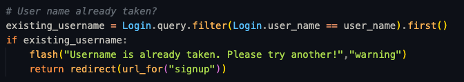
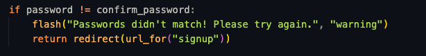
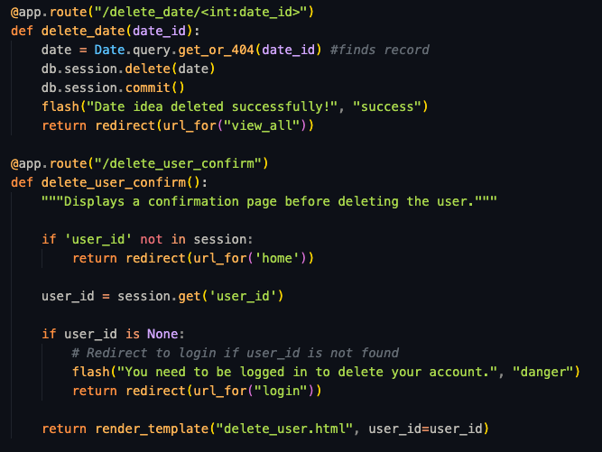
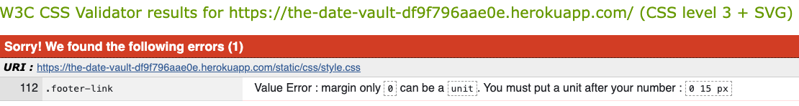

# **The Date Vault**

This website is designed to help couples plan date nights by allowing them to store and randomly retrieve date ideas. Couples can input their unique date ideas with specific compulsory fields. Later, they can filter and request a random idea that suits their preferences from the database they have built over time.

You can access the live site via the following URL - https://the-date-vault-df9f796aae0e.herokuapp.com/

To view a pre-populated date vault please use the following log in details (please don't delete user):

Email - CodeInstitute@google.com
Password - CodeInstitute2024

Please see my Github repository - https://github.com/LukeThornton92/Milestone-Project-3-DATEVAULT

## **Site Overview**

## Table of Contents:

1. [**The Date Vault**](#the-date-vault)
2. [**Planning stage**](#planning-stage)
   - [**_Target Audiences_**](#target-audiences)
   - [**_User Stories_**](#user-stories)
   - [**_Site Aims_**](#site-aims)
   - [**_How Will This Be Achieved_**](#how-will-this-be-achieved)
   - [**_Research_**](#research)
   - [**_Inspiration_**](#inspiration)
   - [**_Wireframes_**](#wireframes)
   - [**_Colour Scheme And Theme_**](#colour-scheme-and-theme)
   - [**_Typography_**](#typography)
3. [**Features**](#features)
   - [**_Home Page_**](#home-page)
   - [**_404_**](#404)
4. [**Future Enhancements**](#future-enhancements)
5. [**Testing**](#testing)
   - [**_Validator Testing_**](#validator-testing)
6. [**Deployment**](#deployment)
7. [**Credits**](#credits)
   - [**_Honourable Mentions_**](#honourable-mentions)
   - [**_General Reference_**](#general-refrence)
   - [**_Content_**](#content)
   - [**_Media_**](#media)

---

## **Planning Stage**

### **Target Audiences:**

- Couples of all ages looking for fresh and fun date ideas to strengthen their relationship.
- Busy partners who want a quick and easy way to generate personalized date plans without spending hours planning.
- Long-term couples seeking new and spontaneous experiences to break routine and keep things exciting.
- Tech-savvy or beginner users who appreciate a user-friendly platform for managing and discovering date ideas.

### **User Stories:**

- As a user, I want to easily input date ideas with specific details so that I can save them for future use.
- As a user, I want to filter date ideas by budget, location, and activity type so I can find the perfect idea for my needs.
- As a user, I want to receive a randomized date idea from my filtered results so I can experience something new and exciting.
- As a user, I want to edit or update my saved date ideas so I can keep my list relevant and up-to-date.
- As a user, I want the interface to be simple and intuitive so I can quickly navigate the site without confusion.
- As a user, I want my data to be stored securely so that I can trust my personal information is safe.

### **Site Aims:**

- To create an accessible and intuitive platform for couples to share and retrieve personalized date ideas.
- To ensure the system offers a variety of filters to allow for a personalized experience when retrieving date ideas.
- To provide randomised suggestions based on user preferences to keep the experience fun and spontaneous.
- To encourage couples to build a rich database of date ideas over time.
- To have a professional look and feel suitable for adults.

### **How Will This Be Achieved:**

My project will ensure the above aims and features are accomplished by successfully achieving the following targets.

- **Database Integration:** Set up a database to store date ideas with compulsory fields (e.g., activity type, cost, duration).
- **Date Input Form:** Develop a form to capture date ideas with validation for compulsory fields.
- **Search and Filter Functionality:** Implement a filtering system based on user preferences such as budget, activity type, and location.
- **Random Date Selector:** Create functionality that selects a random date idea from the filtered search results.
- **User Interface Design:** Focus on building an intuitive, attractive interface for easy navigation and interaction.
- **Security:** Implement basic security features to protect user input and data.

### **Nice To Have's:**

The following items will be nice to have, I will aim to get them into the website in time but these will not be the initial focus.

- Ability to email partners to sign up.
- Google calendar invite for desired dates.

### **Research:**

1. https://mattbateman.net/fun/date-idea-generator/

#### Likes

> - First site found when searched.
> - Has filters.

#### Dislikes

> - Very basic.
> - Cant personalize.
> - Poor design.
> - Can't save any ideas.

---

2. https://thedateidea.com/

#### Likes

> - Modern design.
> - Has blog posts around certain types of dates/date ideas.
> - Lists all date ideas.

#### Dislikes

> - No filters, just a button for randomizing.
> - Can't save any ideas.
> - Poor ad placements.

---

3.  https://myspicyvanilla.com/

Claims to use "AI".

#### Likes

> - Has a function to sign up, will save your ideas.
> - Dates can be shared on Whatsapp and social media.

#### Dislikes

> - Design feels off, colour scheme seems like a poor choice, very dark.
> - Allows only 1 random date before being behind pay wall.

---

4.  https://lovewick.com/ (App)

#### Likes

> - Very professional design, what I aspire to be.
> - Have built on all aspects of dating.

#### Dislikes

> - Less emphasis on your own ideas being in rotation, more for people without ideas.
> - Non web based, all on the app.

---

### **Inspiration:**

Knowing that I want this website to be aimed at adults I needed to do some research into desired styles, I used the website Awwwards for inspiration and came across [Inside The Head](https://www.awwwards.com/sites/inside-the-head-publication#creator), This site has the kind of design that I aspire to generate, so I thought it best to see if I could generate something similar to test myself.

### **Colour Scheme And Theme:**

Taking inspiration from "Inside the head" I developed the below colour pallet, I felt it had mature earthy tones which helps reenforce the adult nature of the site.

My experience with for colours ensured that I made it my focus initially instead of leaving it to the last minute, I liked the white but wanted to make it my own. After playing around with colours for a little while I came across the boney off white called "eggshell". I felt this really helped make the font pop, while maintain a really good contrast against the background.

Following on from my inspiration I spent a rather long time searching for the perfect background image, after not being able to get exactly what I was after I used my iPad and Procreate to draw a simple background (again heavily influenced by "Inside the head")

I also made about 4 or 5 different colour combinations but settled on my first design.

### **Typography**

The main take away from the inspiration was the font, I felt my first project was very restrained and easy to read, good for large amounts of text, my second project aimed at children and the font was very focused towards that. This project was the first time it was strictly for adults. After doing some research I came across 2 fonts that I feel emphasised these points.

- [Calistoga](https://fonts.google.com/specimen/Calistoga?preview.text=Date%20Night%20Generator&preview.size=144&classification=Display&stroke=Serif) - For the headings.

- [Istok Web](https://fonts.google.com/specimen/Istok+Web/tester) - For all other text.

- All fonts were sourced from Google fonts, as stated in the credits.

---

### **Wireframes:**

Desktop wire frame showing the "Add new date" page.

   

Tablet wire frame showing the "Home" page.

   

Phone wire frame showing the "Login" page.

   

---

## **Back End**

Below are some of the steps I went through during building the backend of my site.

### **models.py**

Knowing I wanted to use PostgreSQL (as that is what I learnt) I sat down and drew out my database using [drawsql](https://drawsql.app/), this helped me visualise my project and showed how the 2 tables will talk.

   

This made building out my models.py file much easier, I knew exact names and could start to think about character lengths and if the fields could be nullable. One big thing this highlighted early on was how I was going to link the users account with their partners account, I came up with a easy solution that avoided adding complexity. My solution was to have the main user either sign up or physically get the partner to sign up through the main account, essentially creating 2 ways of logging into the same account.

I first built out my "Login" class which went exactly as planned, I used this in conjunction with my routes.py and tested it ensuring it worked as expected.

After building it first with simple text based passwords I spoke to my mentor concerning hashing my passwords for protection, I as able to go into the Code Institutes non relational database lessons to view the hashing method.

After which I tackled "Date" class which was a little harder due to its size, but using my drawing from before I was able to get through this painlessly. The biggest difficulty during this process was learning that you will need to migrate the changes made to the database which was a frustrating but good learning experience.

During this process I learnt about "Enum", I knew that if I created a dropdown using HTML and CSS only that it could be modified on the browser, allowing someone to modify their input. After doing some reading I decided this was the best way to protect my database from unwanted answers.

My database also has a cascade delete, if a user deletes their login, it will remove all attached dates. This has been tested and works

---

### **routes.py**

This was a built slowly, I would build one page with any functions it may have and would test it manually, once I was happy with it I moved on.

Within this I have a few parts I am proud of:

- **Sign Up:**

My sign up route will query the database reviewing if the email entered is already in the table, if so it will flash a message asking you to login, it will then reload the page. I decided to reload the page instead of redirecting to the login incase the wrong email was entered.

It will also review the username to see if that is taken, usernames will need to be unique.

Along with checking the password and username it also ensures the password and password confirmation are the same.

Once signed up you are redirected to the login page.

- **Login:**

My login route will first ensure all fields are populated to ensure no errors, it will then check to see if the email entered is in the table, it will also check to see if its in the partners email column, key information is then passed to the session to be used later on.

If not a flash warning is raised.

- **Add Partner:**

My add partner is essentially the same as my sign up, except all information is being pushed into the partner side of the table and the document is only accessible if you have no partner information already on your account.

- **New Date Idea:**

Now we are getting into what sets my site apart from other date sites, the ability to log and save your own custom date ideas.

All in all this part was rather simple, at the end of the day its only filling in a form and pushing it to the database, the big thing for me when building this was the inclusion of "Enums". After doing some reading and a little brainstorming with ChatGPT I felt like it was a quick and easy way of getting the results I wanted, it also gave me the ability to change my mind later down the line if I wanted in terms of drop down selections.

In the above example you can see the code referencing the Enum thats imported in from my Models.py file, checking if its a member and if true, assigning that value to be pushed to the database. If false, by someone editing the dropdown it will flash a message, this protects the database.

- **Pick A Date:**

This is the biggest draw to the site and was the reason I even chose this in the first place, I wanted the ability to chose a random date from a collection of dates that I had amassed over a period of time.

First things first I wanted to show a different screen to any new users with no dates, if you don't have a date it should push you to view the date creation page first.

If you have dates you will be shown the form, this is basically a copy of the create date form but missing the notes section. Just input the desired filters depending on what you want and press submit.

My chosen method of filtering the dates was to start with an empty list, collect all the filters and append them into the list and then finally unpack the list of filters and pass that to "query", finally it will pick a random date from the list of dates found.

- **Edit / Delete:**

I have implemented full date editing along with the ability to delete your account, since the logic is so similar I will show the logic behind editing the dates.

First getting the date_id is crucial:

Then passing this over the POST method to update, and finally committing to the database.

Deleting a date follows the same logic as seen below, I have also included the logic for deleting a user.

- **Logout:**

With all the user data being stored in the session, to "logout" I simply clear the session.

- **General Logic:**

To ensure the website is safe I have included some general logic into some of the routes to make sure no one is able to access certain pages while logged in or out, moving forward I will be ensuring I spend more time on not repeating code but this was a late addition to the page.

This protects the page from someone from bypassing previous measures and accessing the page while not logged in.

This protects the page from someone logged in, trying to log in or sign up again.

## **Front End**

Knowing that this project was to show off my backend skills, I gave myself less time than I would normally give to add the finishing touches to my front end development, overall I am happy but I know I have aspects of the site that could be worked on, below I go into more detail about how the website looks and acts.

### **Design**

My first step was admitting defeat on a CSS animation from [Codepen](https://codepen.io/wibs/pen/aVaKJK) of a vault opening when hovered, it was actually the defining moment of me choosing a name for the site. After numerous attempts of getting it to work I simply couldn't, not wanting to invest more time in something that ultimately didn't matter I removed it. This was the vault image you see in the wireframes.

Below are some of the features currently within the site.

### **Nav Bar:**

The Navbar was generated using bootstrap, its a simple design that I quiet like. When hovered over the words turn a burnt yellow which was originally used as a place holder colour but I ended up really liking, when you hover over "Delete user" it will turn bright red to highlight the fact its a dangerous act.

When you click on "logout" you will get a browser warning:

This is because this action will not take you to a new location as a way of protecting you, given its non destructive nature I felt like this was more than enough to stop you making any mistakes.

When on smaller screens we get the navbar burger icon.

Following a tutorial on youtube I was able to copy the SVG file in CSS and modify the coloured lines in the burger.

### **Home Page:**

- My home page is simple and minimalist, a more mature homepage to a website than I have made previously. It conveys a simple message which is all it needs to do.

- Once a user is signed in it will show an alternative message using jinja2.

### **Sign Up and Login:**

These are 2 simple forms, only accessible when you are not logged in as flask reviews the session to see if a user has been passed to it.

The password has a minimum requirement, this was implemented using HTML.

### **New Date Idea:**

- Given the time frame I gave myself for front end development I felt it best to keep it simple, bootstrap really came into play with this as it was able to give me the flexibility and speed needed to build a responsive site. Here you can see me new date form on both desktop and on a mobile device.

The desktop view has form dropdowns and switches sitting side by side.

Then when shrunk down it will go into a vertical format, helping to keep the clean look. The notes text area will also shrink down to help keep the stylistic ratios.

### **Pick A Date:**

The initial screen of the pick a date looks identical to the new date idea form just without the notes, but when you select your filters you will have the following screen.

This card is generated using javascript switching the display from "None".

Stylistically I have issues with this card, ignoring the blue border around the main title that I spent hours trying to remove, We have text in caps (from my Enum class) and some underscores. Given more time these will be removed.

We have 2 buttons on the page, one allowing you to re-roll to get another random date and another that will simply refresh the page (adding display: None) so you can change the desired filters, the buttons on this page also have a colour change when hovered over.

### **View All:**

The view all page allows you to see you entire vault of date, this serves as a way for you to review all, make and changes or edits (incase a mistake was made during the date build process) and to delete any dates (such as a restaurant closing down).

clicking edit will allow you to see the edit date page, this is simply a copy of the new date page but with your information populated so you can modify. In the example below I have not changed any fields, these were all pre selected. Submitting this page takes you back to the view all.

On small screens these individual cards are stacked on top of each other.

Deleting from this page will give you a browser warning.

As you can see from the above example a flask flash is at the top of the screen from submitting the last edit.

### **Add partner:**

The add partner page is again a copy of the sign up form.

### **Delete User:**

You get a page just for a confirmation.

And then one last browser pop up to make sure you are are positive.

### **Tab Icon:**

- I found a cool tab icon [favicon!](https://www.flaticon.com/free-icons/vault), I like it and it fits the theme!

### **404:**

- A simple 404 if something goes wrong, which has links back to all the pages available depending if the user in logged in. I would show you a render but in all honesty I don't know how to force a 404 to open when using flask!

---

## **Testing**

I tested the site throughout the development phase using the following:

- Apple Macbook air 13"
- iPhone 15 Pro Max

I also used Google dev-tools during development, ensuring responsiveness across all screen sizes.

Along with my devices I passed the site onto numerous friends and colleagues who tested the site on both Apple and Android devices varying in all sizes. This was beneficial as it helped highlight a few sizing issues surround buttons and fonts.

- All links on homepage.html and 404.html have been tested and are in working order.

- In terms of Python testing I would use numerous print statements (which I have left in as proof), these were invaluable as I was able to see exactly what my code was outputting and build off of it. This helped so much that at the last stages of this project I was coding solutions to problems without any issues or reading online.

### **Validator Testing:**

#### **CSS:**

After running the site through the CSS validator I got 1 error.

This was simply a space after a value, this was resolved and now I have no errors.

#### **HTML:**

After running the site through the HTML validator I got 5 errors.

- These all seemed to be from Flasks/jinja2's interaction with the webpage and the validator, if not I will modify at a later date.

#### **Javascript:**

I ran my JS code through JSHint:

No errors

### **LightHouse Testing:**

Using the LightHouse in my Google DevTools I was able to optimize my website for Performance, Accessibility, SEO and best practices.

- I was happy with my score on mobile.

- I was happy with my score on desktop.

## **Future-Enhancements**

The following is a list of future enhancements that I would like to implement given more time and/or knowledge.

- For some reason my pages were slightly too large, my idea was a static page that you didn't need to scroll on but for the life of me I couldn't fix it.

- Pagination. My view all dates was originally planned to be capped at 9 per page, and then having either a scroll or arrow buttons to "rotate the page" to the next 9 dates. This simply would have eaten up too much time. Moving forward now I know what its called and the fact its built into flask I would be confident to tackle this early giving it the time needed.

- Email ability, being able to send your partner an email asking them to sign up and linking accounts that way.

- Google calendar invites, having the date you picked able to create a calendar invited based on date and time.

## **Credits**

### **Honorable Mentions:**

This project could not have happened without the support of the following people listed in no particular order:

- Jessica Goff, for putting up with me.

- Richard Wells, a brilliant mentor keeping me on track.

### **General Reference:**

- I relied upon W3schools, ChatGPT and stack overflow for general references throughout the project.

### **Content:**

- All content was written by myself

- Button Icons - https://fontawesome.com/

- Fonts - https://fonts.google.com/

- Bootstrap

### **Media:**

- Wallpaper - https://www.vecteezy.com/vector-art/1110375-stars-and-planets-in-outer-space

- Favicon - https://www.iconarchive.com/show/free-flat-sample-icons-by-thesquid.ink/space-rocket-icon.html#google_vignette
